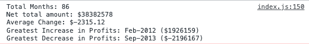

# Console Fianances Challenge

## Overview
Analyse the financial records for a company. Calculate the total number of months, net total profits, average change month-on-month change in profits and the months where profits increased and decreased by the largest amounts. 

## My Solution

